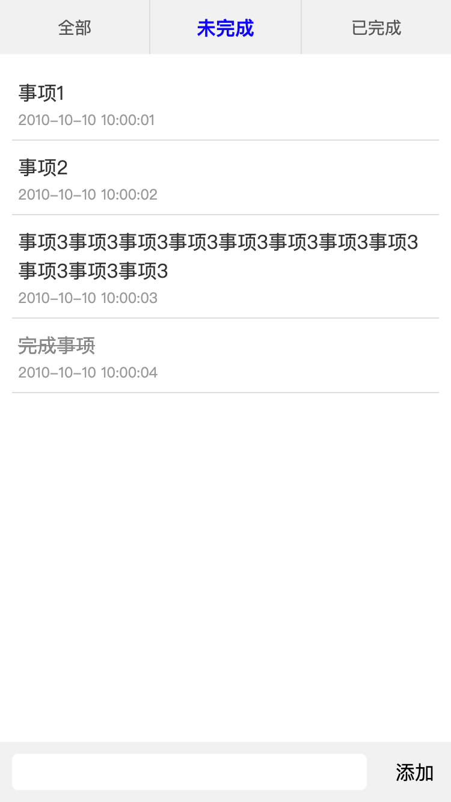
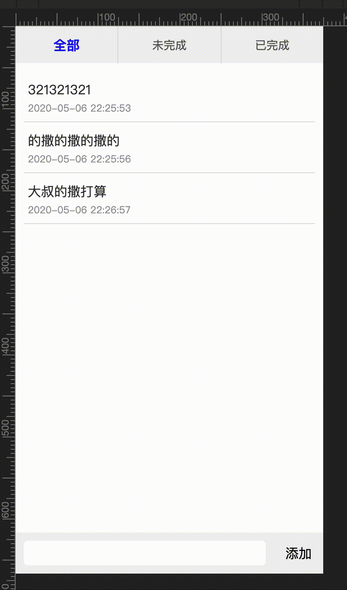

# react-hook-learn
## todo-list
* 功能
  1. list
  2. add item
  3. filter
* 设计图
* 框架搭建, UI 搭建
  ```tsx
  import * as React from "react"
  import style from './index.css'
  export const Index = (): React.ReactElement => {
  return (
    <div className={style.app}>
      <div className={style.filterBox}>
        <div className={style.filterItem}>全部</div>
        <div className={style.filterItemActive}>未完成</div>
        <div className={style.filterItem}>已完成</div>
      </div>
      <div className={style.todoList}>
        <div className={style.todoItem}>
          <div className={style.todoItemContent}>事项1</div>
          <div className={style.todoItemTime}>2010-10-10 10:00:01</div>
        </div>
        <div className={style.todoItem}>
          <div className={style.todoItemContent}>事项2</div>
          <div className={style.todoItemTime}>2010-10-10 10:00:02</div>
        </div>
        <div className={style.todoItem}>
          <div className={style.todoItemContent}>事项3事项3事项3事项3事项3事项3事项3事项3事项3事项3事项3</div>
          <div className={style.todoItemTime}>2010-10-10 10:00:03</div>
        </div>
        <div className={style.todoItem}>
          <div className={style.todoItemContentCompleted}>完成事项</div>
          <div className={style.todoItemTime}>2010-10-10 10:00:04</div>
        </div>
      </div>
      <div className={style.addBox}>
        <input className={style.addInput} type='text' />
        <div className={style.addButton}>添加</div>
      </div>
    </div>
  )
  } 
  ```
  
* 逻辑编写
  ```tsx
  import * as React from "react"
  import { cloneDeep } from "lodash"
  import style from './index.css'
  enum FILTERTYPE {
    all,
    active,
    completed
  }
  interface TodoItem {
    content: string;
    type: FILTERTYPE;
    ts: string;
  }
  const FILETEXTARR = ['全部', '未完成', '已完成']
  const needAddZero = (num: number): string => {
    return num < 10 ? `0${num}` : num.toString()
  }
  const formatDate = (date: Date): string => {
    const Y = date.getFullYear()
    const M = needAddZero(date.getMonth() + 1)
    const D = needAddZero(date.getDate())
    const h = needAddZero(date.getHours())
    const m = needAddZero(date.getMinutes())
    const s = needAddZero(date.getSeconds())
    return `${Y}-${M}-${D} ${h}:${m}:${s}`
  }
  export const Index = (): React.ReactElement => {
    // 数据
    const [filterType, setFilterType] = React.useState<FILTERTYPE>(FILTERTYPE.all)
    const [todoList, setTodoList] = React.useState<TodoItem[]>([])
    const [inputContent, setInputContent] = React.useState<string>('')
    // 逻辑
    const handleInput = (e: React.ChangeEvent<HTMLInputElement>): void => {
      setInputContent(e.currentTarget.value)
    }
    const handleAddBtn = (): void => {
      const newTodoItem: TodoItem = {
        content: inputContent,
        type: FILTERTYPE.active,
        ts: formatDate(new Date())
      }
      const newTodoList: TodoItem[] = cloneDeep(todoList)
      newTodoList.push(newTodoItem)
      setInputContent('')
      setTodoList(newTodoList)
    }
    const handleChangeItemState = (e: React.MouseEvent<HTMLDivElement>): void => {
      const ele: HTMLDivElement = e.target as HTMLDivElement
      const index: string | null = ele.getAttribute('data-index')
      if (index != null) {
        const pos = Number(index)
        
        const newTodoList: TodoItem[] = cloneDeep(todoList)
        const type: FILTERTYPE = newTodoList[pos].type
        if (type == FILTERTYPE.active) {
          newTodoList[pos].type = FILTERTYPE.completed
        }
        else{
          newTodoList[pos].type = FILTERTYPE.active
        }
        setTodoList(newTodoList)
      }

    }
    const handlefilterBtn = (e: React.MouseEvent<HTMLDivElement>): void => {
      const ele: HTMLDivElement = e.target as HTMLDivElement
      const type: FILTERTYPE = Number(ele.getAttribute('data-index'))
      setFilterType(type)
    }
    //渲染
    const renderFilterBox = (): React.ReactElement => {
      const arr: React.ReactElement[] = []
      FILETEXTARR.map((item: string, index: number) => {
        const className = index == filterType ? style.filterItemActive : style.filterItem
        arr.push(
          <div data-index={index} key={index} className={className}> {item} </div>
        )
      })
      return (
        <div onClick={handlefilterBtn} className={style.filterBox}>
          {arr}
        </div>
      )
    }
    const renderTodoList = (): React.ReactElement => {
      const arr: React.ReactElement[] = []
      todoList.map((item: TodoItem, index: number): void => {
        let className = style.todoItemContent
        if ((filterType == FILTERTYPE.active && item.type == FILTERTYPE.completed) || filterType == FILTERTYPE.completed && item.type == FILTERTYPE.active) {
          return
        }
        if (item.type == FILTERTYPE.completed) {
          className = style.todoItemContentCompleted
        }
        arr.push(
          <div
            data-index={index}
            key={index}
            className={style.todoItem}
          >
            <div className={className}>{item.content}</div>
            <div className={style.todoItemTime}>{item.ts}</div>
          </div>
        )
      })
      return (
        <div onClick={handleChangeItemState} className={style.todoList}> {arr} </div>
      )
    }
    return (
      <div className={style.app}>
        {renderFilterBox()}
        {renderTodoList()}
        <div className={style.addBox}>
          <input value={inputContent} onChange={handleInput} className={style.addInput} type='text' />
          <div onClick={handleAddBtn} className={style.addButton}>添加</div>
        </div>
      </div>
    )
  } 
  ```
  
* 细节优化
  * 分离非主逻辑代码
  * 存储 (自定义 useState)
  * 组件拆分 & 性能优化
    * 父组件 -（数据）> 子组件 ：Header / List 组件
    * 子组件传递数据给父组件: AddBox 组件
  * 修改自定义 useState （泛性的使用）
  ```tsx
    /*
    ├── components （useMeno）
    │   └── index
    │       ├── addBox.tsx 拆分出底部的输入框+确认按钮。state 内部独有，只需要父节点提供一个 addTodoItem 函数来把输入内容导出
    │       ├── header.tsx 顶部过滤选项按钮
    │       ├── index.css
    │       ├── index.tsx  主要的父节点
    │       └── list.tsx 中间列表
    ├── config
    │   ├── help.ts  帮助函数 如上面的 formatDate
    │   ├── index.ts 自定义的 useXXX (useState setValue 的函数式赋值)
    │   └── interface.ts interface 之类的放置这里
    */
    
  ```
* 问题
  * 执行顺序：一个 `react` 函数组件的执行流程下来，哪些会执行，哪些不会执行
  * hook return UI ?